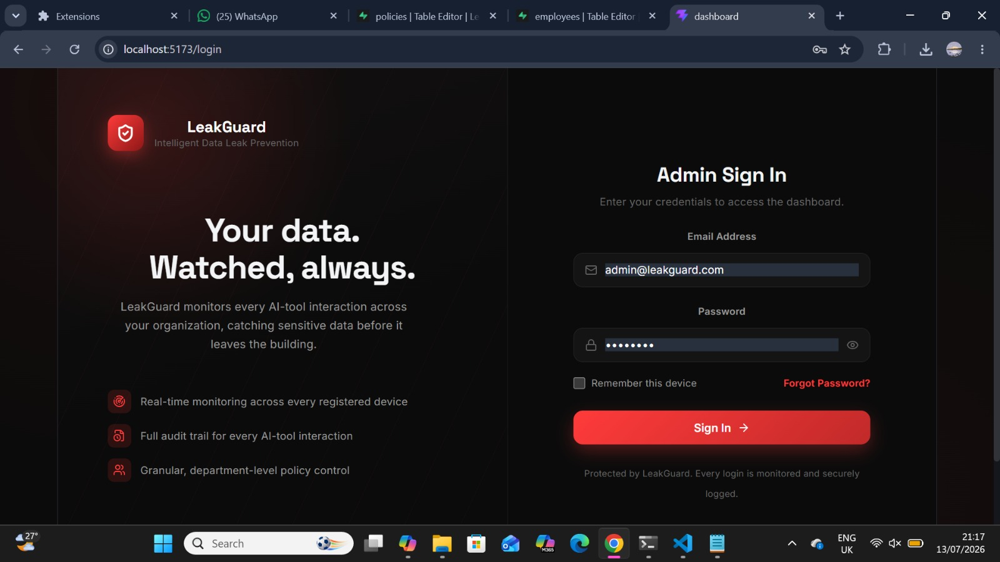
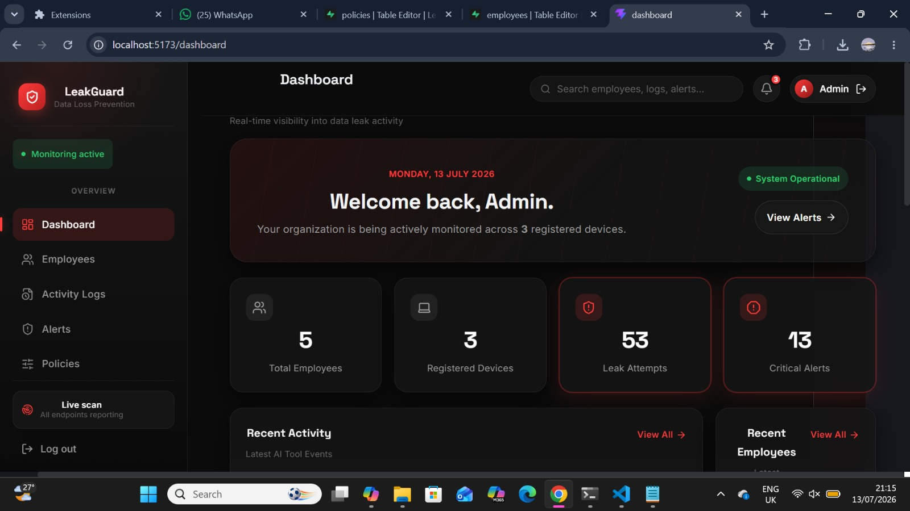
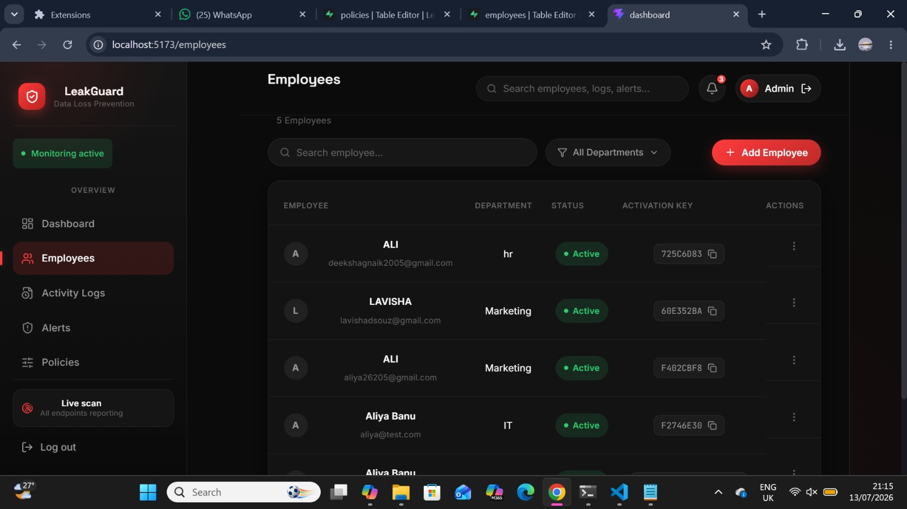
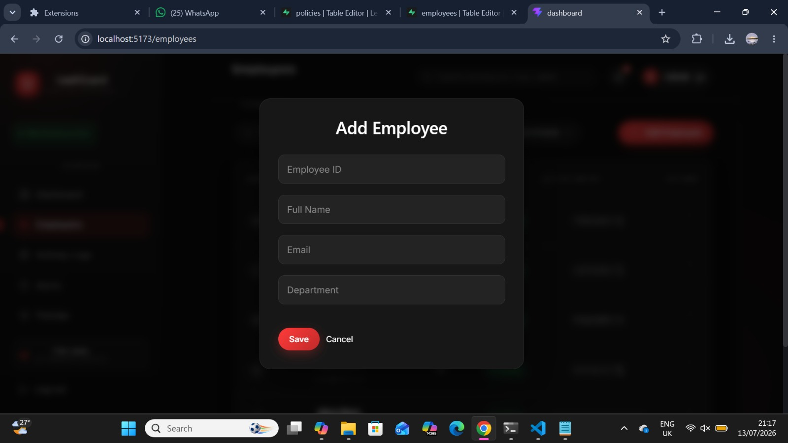
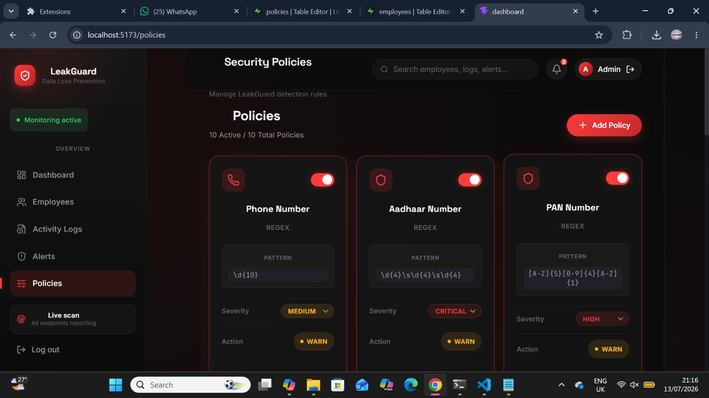
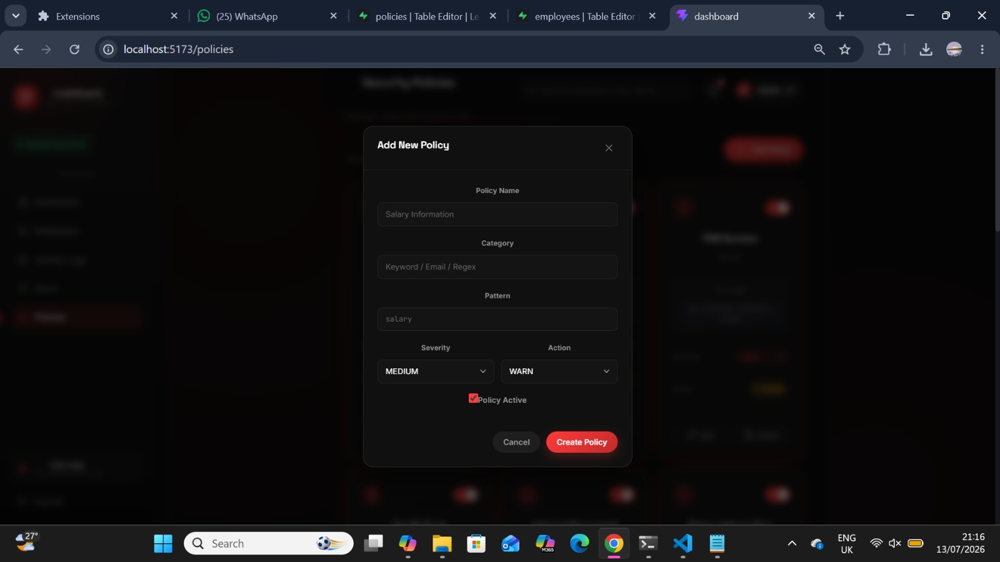
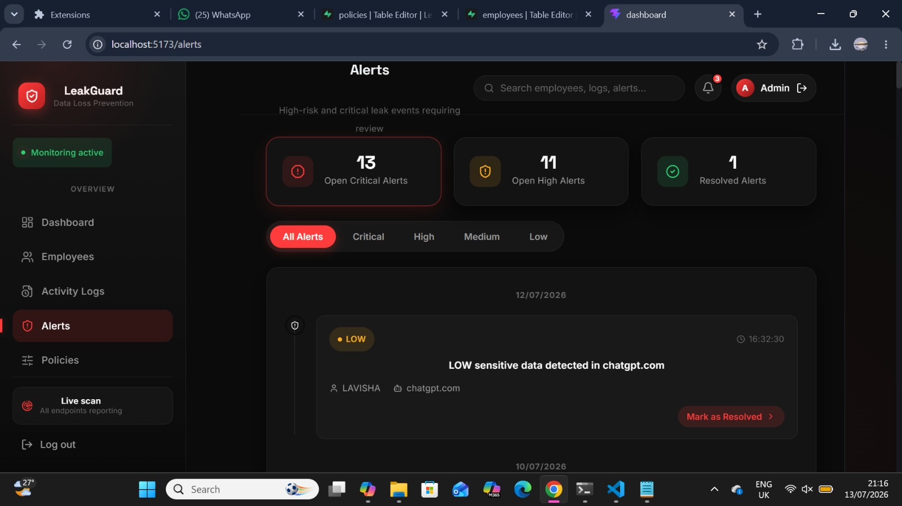
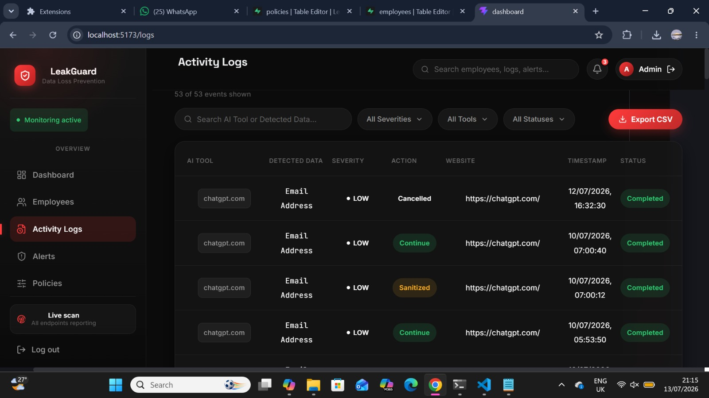
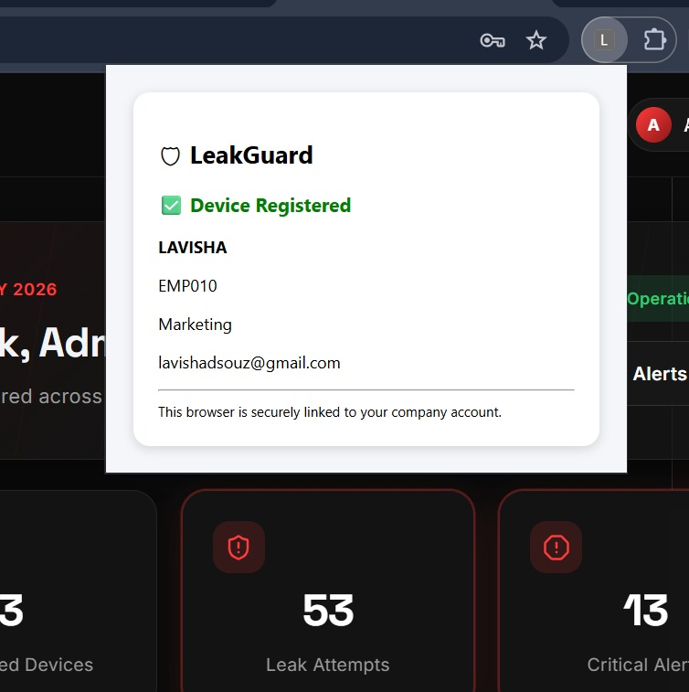
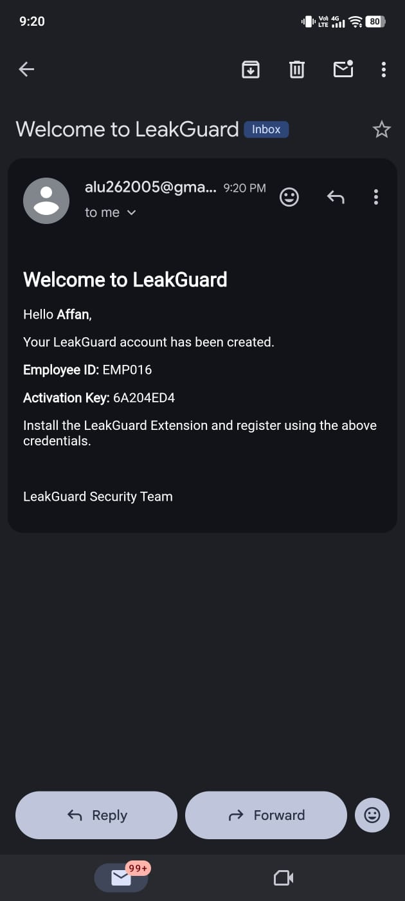

# 🛡️ LeakGuard
### Intelligent Data Leak Prevention System for Modern Workplaces


---

## 📖 About The Project

LeakGuard is a browser-based **Data Leak Prevention (DLP)** system designed to reduce the risk of employees accidentally sharing confidential company information with AI tools and web applications.

The system continuously monitors user input on supported websites, detects sensitive information using customizable security policies, alerts users before data is submitted, and provides administrators with a centralized dashboard for monitoring activities and managing security policies.

The project was developed as a cybersecurity-focused academic project to demonstrate practical implementation of browser security, policy-based detection, and real-time monitoring.

---

# ✨ Key Features

### 🔒 Sensitive Data Detection

LeakGuard detects:

- 📧 Email Addresses
- 📱 Phone Numbers
- 🆔 Aadhaar Numbers
- 🪪 PAN Numbers
- 💳 Credit Card Numbers
- 🔑 API Keys
- 🔐 Passwords
- 🏢 Employee IDs
- 📝 Custom Regex Patterns

---

### 🌐 Supported Platforms

LeakGuard currently monitors:

- ChatGPT
- Google Gemini
- Claude AI
- Microsoft Copilot
- Perplexity AI
- Grok

---

### 👨‍💼 Admin Dashboard

- Dashboard Analytics
- Employee Management
- Policy Management
- Alert Monitoring
- Activity Logs
- Employee Registration
- Activation Key Generation
- Automatic Welcome Email

---

### ⚠️ Real-Time Protection

When confidential information is detected:

- Sensitive data is identified instantly.
- A warning popup is displayed.
- Risk level is shown.
- Users can sanitize their content before submission.
- Activities are logged.
- Alerts are sent to administrators.

---

# 🛠 Tech Stack

## Frontend

- React.js
- Vite
- HTML5
- CSS3
- JavaScript

## Backend

- Node.js
- Express.js

## Database

- Supabase

## Browser Extension

- Chrome Extension (Manifest V3)

## Tools

- Git
- GitHub
- REST APIs
- Chrome Storage API
- Nodemailer

---
# 📋 Prerequisites

Before running LeakGuard, ensure you have:

- Node.js (v18 or later)
- npm
- Google Chrome
- A Supabase account
- A Gmail account (for email notifications)
- Git
  
# 📂 Project Structure

```
LeakGuard
│
├── backend
│   ├── controllers
│   ├── routes
│   ├── server.js
│   ├── package.json
│
├── dashboard
│   ├── src
│   ├── public
│
├── extension
│   ├── background.js
│   ├── content.js
│   ├── detector.js
│   ├── popupUI.js
│   ├── sanitizer.js
│   ├── manifest.json
│
├── database
│   └── schema.sql
│
├── screenshots
│
└── README.md
```

---

# 🚀 How LeakGuard Works

1. Administrator registers a new employee.
2. System generates an Employee ID and Activation Key.
3. Welcome email is automatically sent.
4. Employee installs the Chrome Extension.
5. Employee activates the extension.
6. LeakGuard downloads the latest security policies.
7. User visits supported AI websites.
8. LeakGuard scans every prompt before submission.
9. If sensitive information is detected:
   - Warning popup appears.
   - Activity is logged.
   - Alert is created.
10. Administrators can review all events from the dashboard.

---

# 🔐 Policy Engine

LeakGuard uses a **policy-based detection engine**.

Administrators can:

- Create new policies
- Delete policies
- Enable/Disable policies
- Configure Regex Patterns
- Set Risk Levels

The extension automatically downloads the latest policies from the backend.

---

# 📊 Dashboard Modules

- 📈 Dashboard Overview
- 👥 Employee Management
- 🛡 Policy Management
- 🚨 Alerts
- 📋 Activity Logs


---

# 💡 Future Enhancements

- AI-based Sensitive Data Detection
- OCR Image Scanning
- File Upload Protection
- Email Monitoring
- Cloud Storage Monitoring
- Multi-browser Support
- Role-Based Access Control
- Organization-wide Policy Synchronization


# 🗄️ Database Setup

1.  Create a new Supabase project.
2.  Open **SQL Editor**.
3.  Run `database/schema.sql`.
4.  Create `backend/.env` using `backend/.env.example`.

## Environment Variables

Create `backend/.env`:

``` env
PORT=5000
SUPABASE_URL=YOUR_SUPABASE_URL
SUPABASE_SERVICE_ROLE_KEY=YOUR_SUPABASE_SERVICE_ROLE_KEY
EMAIL_USER=YOUR_EMAIL@gmail.com
EMAIL_PASS=YOUR_GMAIL_APP_PASSWORD
```

> **Never commit your real `.env` file to GitHub.** Only commit
> `.env.example`.


# ⚙ Installation

## 1. Clone Repository

```bash
git clone https://github.com/aliya26205/LeakGuard.git
```

## 2. Backend Setup

```bash
cd backend
npm install
```

## 3. Create Environment File

Copy:

```
.env.example
```

Rename it to:

```
.env
```

Update the values:

```env
PORT=5000
SUPABASE_URL=YOUR_SUPABASE_URL
SUPABASE_SERVICE_ROLE_KEY=YOUR_SUPABASE_SERVICE_ROLE_KEY
EMAIL_USER=YOUR_EMAIL@gmail.com
EMAIL_PASS=YOUR_GMAIL_APP_PASSWORD
```

Start the backend:

```bash
npm start
```

## 4. Dashboard

```bash
cd ../dashboard
npm install
npm run dev
```

## 5. Database

- Create a Supabase project.
- Open SQL Editor.
- Run `database/schema.sql`.

## 6. Chrome Extension

1. Open `chrome://extensions`
2. Enable Developer Mode.
3. Click **Load unpacked**.
4. Select the `extension` folder.

# 📸 Screenshots

## 🔐 Login



---

## 📊 Dashboard



---

## 👥 Employee Management



---

## ➕ Add Employee



---

## 🛡 Policy Management



---

## ➕ Add Policy



---

## 🚨 Alerts



---

## 📋 Activity Logs



---

## 🧩 Chrome Extension



---

## 📧 Welcome Email



---

# 🔒 Security

-   `.env` is intentionally excluded from Git.
-   Use `backend/.env.example` as a template.
-   Create your own Supabase project and Gmail App Password.
-   Never expose production credentials.


# 👥 Team

-   **Aliya Banu**
-   **Chaithra**
-   **Lavisha**
-   **Deeksha**
---

# 👩‍💻 Developer

**Aliya Banu**

MCA Student

Department of Computer Applications

St Joseph Engineering College, Vamanjoor, Mangaluru

---
# 🔗 Connect

**GitHub:** https://github.com/aliya26205

**LinkedIn:** https://www.linkedin.com/in/aliya-banu26/

# 📄 License

This project is licensed under the MIT License.

⭐ If you found this project useful, consider giving it a star on
GitHub.
